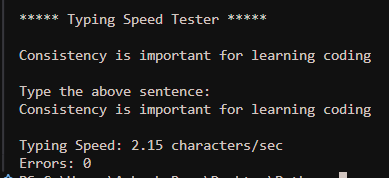
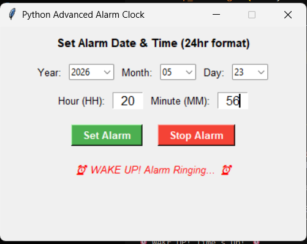
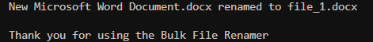

<div align="center">

# Python Practice Projects


### Beginner Friendly Python Mini Projects

A collection of simple Python projects to practice programming, improve logic building, and create real-world applications.

<br>


</div>

---

# Project Showcase

<table>
<tr>

<td width="50%" align="center">

## QR Code Generator

Generate QR codes instantly from text or URLs.


</td>

<td width="50%" align="center">

## Typing Speed Tester

Measure typing speed and accuracy using Python.



</td>

</tr>

<tr>

<td width="50%" align="center">

## Alarm Clock

Simple Python alarm clock application with GUI.



</td>

<td width="50%" align="center">

## Bulk File Renamer

Rename multiple files automatically using Python.



</td>

</tr>
</table>

---

# Technologies Used


<br>

- Python
- Tkinter
- qrcode
- os module
- time module

---

# Folder Structure

```bash
python-practice-projects/
│
├── 01_qr_code_generator/
│   ├── main.py
│   └── 03-output.png
│
├── 02_typing_speed_tester/
│   ├── main.py
│   └── 02-output.png
│
├── 03_alarm_clock/
│   ├── main.py
│   └── 03-output.png
│
├── 04_bulk_file_rename/
│   ├── main.py
│   └── 04-output.png
│
└── README.md
```

---

# Installation

Clone the repository:

```bash
git clone https://github.com/your-username/python-practice-projects.git
```

Move into the project directory:

```bash
cd python-practice-projects
```

Install dependencies:

```bash
pip install -r requirements.txt
```

---

# Run Any Project

Example:

```bash
cd 01_qr_code_generator
python main.py
```

---

# Features

- Beginner Friendly Projects
- Easy To Understand Code
- GUI Based Applications
- Real Practice Projects
- Clean Folder Structure
- Perfect For Students

---

# Contributing

Contributions are welcome.

1. Fork the repository
2. Create a new branch
3. Make changes
4. Submit a Pull Request

---

# Support

If you like these projects, give this repository a star.

---

# License

This project is licensed under the MIT License.

---

<div align="center">

Made with Python


</div>
